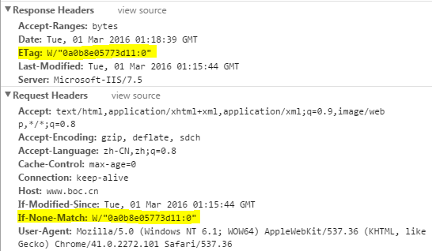
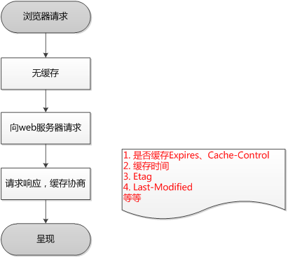
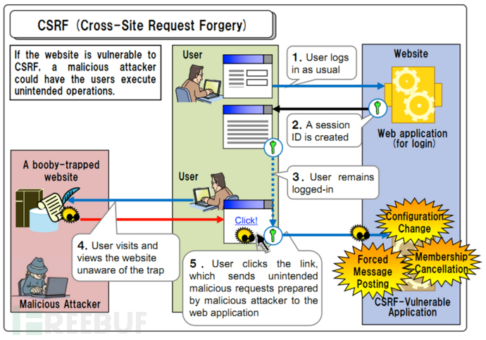

# 学习目标

`一次完整的http服务过程`

- [ ] 能够说出一次完整的http服务的几个阶段
- [ ] 能够说出html的渲染过程
- [ ] 能够说出常见的http请求状态码

`http缓存控制` 

* [ ] 能够理解http缓存控制 主要是指浏览器缓存
* [ ] 知道强缓存和协商缓存
* [ ] 知道http强缓存的控制字段
* [ ] 知道协商缓存的配置方式和各自的优缺点

`fetch与axios`

* [ ] 理解fetch和axios分别是什么？
* [ ] 掌握fetch的优缺点
* [ ] 掌握axios的优缺点

`浏览器内多个标签页之间的通讯`

* [ ] 知道浏览器多个标签页通讯的常见使用场景
* [ ] 知道有浏览器存储和借助服务器推送事件两类实现通讯的方式
* [ ] 掌握两种两种浏览器存储的方式实现通讯
* [ ] 了解服务端实现通讯的方式

`XSS CSRF以及如何防范` 

* [ ]  理解xss和csrf分别是什么
* [ ] 理解xss的三种类型
* [ ] 能够说出一种xss的攻击
* [ ] 理解csrf的攻击过程
* [ ] 知道xss的防范方式
* [ ] 知道csrf的三种防范方式

---


# 一次完整的HTTP服务过程

### 题意分析

当我们在web浏览器的地址栏中输入：`www.baidu.com`，具体发生了什么？

1. 对`www.baidu.com`这个网址进行DNS域名解析，得到对应的IP地址
2. 根据这个IP，找到对应的服务器，发起TCP的三次握手
3. 建立TCP连接后发起HTTP请求
4. 服务器响应HTTP请求，浏览器得到html代码
5. 浏览器解析html代码，并请求html代码中的资源（如js、css、图片等）（先得到html代码，才能去找这些资源）
6. 浏览器对页面进行渲染呈现给用户
7. 服务器关闭关闭TCP连接

注：

1.DNS怎么找到域名的？

> DNS域名解析采用的是递归查询的方式，过程是，先去找DNS缓存->缓存找不到就去找根域名服务器->根域名又会去找下一级，这样递归查找之后，找到了，给我们的web浏览器

2.为什么HTTP协议要基于TCP来实现？  

> TCP是一个端到端的可靠的面相连接的协议，HTTP基于传输层TCP协议不用担心数据传输的各种问题（当发生错误时，会重传）

3.最后一步浏览器是如何对页面进行渲染的？  

> a）解析html文件构成 DOM树
> b）解析CSS文件构成渲染树
> c）边解析，边渲染
> d）JS 单线程运行，JS有可能修改DOM结构，意味着JS执行完成前，后续所有资源的下载是没有必要的，所以JS是单线程，会阻塞后续资源下载

**各个步骤具体细节**

**DNS解析（域名解析服务器）**

a）首先会搜索浏览器自身的DNS缓存（缓存时间比较短，大概只有1分钟，且只能容纳1000条缓存）

b）如果浏览器自身的缓存里面没有找到，那么浏览器会搜索系统自身的DNS缓存

c）如果还没有找到，那么尝试从 hosts文件里面去找

d）在前面三个过程都没获取到的情况下，就递归地去域名服务器去查找，具体过程如下


DNS优化两个方面：DNS缓存、DNS负载均衡

**TCP连接建立（三次握手）**

拿到域名对应的IP地址之后，User-Agent（一般指浏览器）会以一个随机端口（1024<端口<65535）向服务器的WEB程序（常用的有httpd，nginx）等的80端口。这个连接请求（原始的http请求经过TCP/IP  4层模型的层层封包）到达服务器端后（这中间有各种路由设备，局域网内除外），进入到网卡，然后是进入到内核的TCP/IP协议栈（用于识别连接请求，解封包，一层一层的剥开），还有可能要经过Netfilter防火墙（属于内核的模块）的过滤，最终达到WEB程序，最终建立了TCP/IP的连接。

**发起HTTP请求(建立连接后)**

HTTP请求报文由三部分组成：请求行，请求头、空行 / 请求正文

**请求行：**用于描述客户端的请求方式（GET/POST等），请求的资源名称(URL)以及使用的HTTP协议的版本号

**请求头：**用于描述客户端请求哪台主机及其端口，以及客户端的一些环境信息等

**空行：**空行就是\r\n (POST请求时候有)

**请求正文：**当使用POST等方法时，通常需要客户端向服务器传递数据。这些数据就储存在请求正文中（GET方式是保存在url地址后面，不会放到这里）

举例：

**GET请求**

下面是浏览器对 http://localhost:8081/test?name=XXG&age=23的GET 请求时发送给服务器的数据：


可以看出请求包含请求行和请求头两部分。其中请求行中包含 method（例如 GET、POST）、URI（通一资源标志符）和协议版本三部分，三个部分之间以空格分开。请求行和每个请求头各占一行，以换行符 CRLF（即 \r\n）分割。

**POST请求**

下面是浏览器对 http://localhost:8081/test 的 POST 请求时发送给服务器的数据，消息体中带上参数 name=XXG&age=23


可以看出，上面的请求包含三个部分：请求行、请求头、空格/消息体，比之前的 GET 请求多了一个请求消息，其中 请求头和消息体之间用一个空行分割。POST 请求的参数不在 URL 中，而是在消息体中，请求头中多了一项 Content-Length 用于表示消息体的字节数，这样服务器才能知道请求是否发送结束。这也就是 GET 请求和 POST 请求的主要区别。

**那么起始行中的请求方法有哪些种呢？**

> GET: 完整请求一个资源 （常用）
>  HEAD: 仅请求响应首部
>  POST：提交表单  （常用）
>  PUT: (webdav) 上传文件（但是浏览器不支持该方法）
>  DELETE：(webdav) 删除
>  OPTIONS：返回请求的资源所支持的方法的方法
>  TRACE: 追求一个资源请求中间所经过的代理（该方法不能由浏览器发出）

**那什么是URL、URI、URN？**

> URI  Uniform Resource Identifier 统一资源标识符
> URL  Uniform Resource Locator 统一资源定位符
> URN  Uniform Resource Name 统一资源名称

URL和URN 都属于 URI，为了方便就把URL和URI暂时都通指一个东西

**服务器响应http请求，浏览器得到html代码**

HTTP响应也由三部分组成：状态行，响应头，空格，消息体

状态行包括：协议版本、状态码、状态码描述

**状态码：**状态码用于表示服务器对请求的处理结果

> 1xx：指示信息——表示请求已经接受，继续处理
> 2xx：成功——表示请求已经被成功接收、理解、接受。
> 3xx：重定向——要完成请求必须进行更进一步的操作
> 4xx：客户端错误——请求有语法错误或请求无法实现
> 5xx：服务器端错误——服务器未能实现合法的请求。


列举几种常见的：

> 200（没有问题） 
> 302（要你去找别人） 
> 304（要你去拿缓存） 
> 307（要你去拿缓存） 
> 403（有这个资源，但是没有访问权限） 
> 404（服务器没有这个资源） 
> 500（服务器这边有问题）

**响应头：**响应头用于描述服务器的基本信息，以及客户端如何处理数据

**空格：**CRLF（即 \r\n）分割

**消息体：**服务器返回给客户端的数据

响应格式如下图


上面的 HTTP 响应中，响应头中的 Content-Length 同样用于表示消息体的字节数。Content-Type 表示消息体的类型，通常浏览网页其类型是HTML，当然还会有其他类型，比如图片、视频等。

**浏览器解析html代码，并请求html代码中的资源**

浏览器拿到html文件后，就开始解析其中的html代码，遇到js/css/image等静态资源时，就向服务器端去请求下载（会使用多线程下载，每个浏览器的线程数不一样），这是时候就用上 keep-alive特性了，建立一次HTTP连接，可以请求多个资源，下载资源的顺序就是按照代码里面的顺序，但是由于每个资源大小不一样，而浏览器又是多线程请求请求资源，所以这里显示的顺序并不一定是代码里面的顺序。

**浏览器对页面进行渲染呈现给用户**

最后，浏览器利用自己内部的工作机制，把请求的静态资源和html代码进行渲染，渲染之后呈现给用户，浏览器是一个边解析边渲染的过程。

首先浏览器解析HTML文件构建DOM树，然后解析CSS文件构建渲染树，等到渲染树构建完成后，浏览器开始布局渲染树并将其绘制到屏幕上。

这个过程比较复杂，涉及到两个概念: reflow(回流)和repain(重绘)。

DOM节点中的各个元素都是以盒模型的形式存在，这些都需要浏览器去计算其位置和大小等，这个过程称为relow;当盒模型的位置,大小以及其他属性，如颜色,字体,等确定下来之后，浏览器便开始绘制内容，这个过程称为repain。

页面在首次加载时必然会经历reflow和repain。

reflow和repain过程是非常消耗性能的，尤其是在移动设备上，它会破坏用户体验，有时会造成页面卡顿。所以我们应该尽可能少的减少reflow和repain。

JS的解析是由浏览器中的JS解析引擎完成的。

JS是单线程运行，JS有可能修改DOM结构，意味着JS执行完成前，后续所有资源的下载是没有必要的，所以JS是单线程，会阻塞后续资源下载。

**服务器关闭关闭TCP连接**

一般情况下，一旦Web服务器向浏览器发送了请求数据，它就要关闭TCP连接，然后如果浏览器或者服务器在其头信息加入了这行代码：

```shell
Connection:keep-alive 
```

TCP连接在发送后将仍然保持打开状态，于是，浏览器可以继续通过相同的连接发送请求。保持连接节省了为每个请求建立新连接所需的时间，还节约了网络带宽。

自此一次完整的HTTP事务宣告完成.

### 明确考察点

1. 地址栏输入url开始， 域名到ip的过程
2. 拿到ip， 开始建立http请求
3. 拿到html之后的浏览器的渲染过程

### 回答思路

​	先说从url到拿到html的过程，然后重点阐述html的渲染过程。之后面试官再次提问的侧重回答（如：重排，重绘、tcp 三次握手四次挥手）。

### 相关扩展

1. [tcp 三次握手四次挥手](https://blog.csdn.net/qq_38950316/article/details/81087809)


# http缓存控制

### 题意分析

Web 缓存大致可以分为：数据库缓存、服务器端缓存（代理服务器缓存、CDN 缓存）、浏览器缓存。

浏览器缓存也包含很多内容： HTTP 缓存、indexDB、cookie、localstorage 等等。这里我们只讨论 HTTP 缓存相关内容。

在具体了解 HTTP 缓存之前先来明确几个术语：

- 缓存命中率：从缓存中得到数据的请求数与所有请求数的比率。理想状态是越高越好。
- 过期内容：超过设置的有效时间，被标记为“陈旧”的内容。通常过期内容不能用于回复客户端的请求，必须重新向源服务器请求新的内容或者验证缓存的内容是否仍然准备。
- 验证：验证缓存中的过期内容是否仍然有效，验证通过的话刷新过期时间。
- 失效：失效就是把内容从缓存中移除。当内容发生改变时就必须移除失效的内容。

浏览器缓存主要是 HTTP 协议定义的缓存机制。HTML meta 标签，例如

<META HTTP-EQUIV="Pragma" CONTENT="no-store">

含义是让浏览器不缓存当前页面。但是代理服务器不解析 HTML 内容，一般应用广泛的是用 HTTP 头信息控制缓存。

**浏览器缓存分类**

浏览器缓存分为强缓存和协商缓存，浏览器加载一个页面的简单流程如下：

1. 浏览器先根据这个资源的http头信息来判断是否命中强缓存。如果命中则直接加在缓存中的资源，并不会将请求发送到服务器。（强缓存）
2. 如果未命中强缓存，则浏览器会将资源加载请求发送到服务器。服务器来判断浏览器本地缓存是否失效。若可以使用，则服务器并不会返回资源信息，浏览器继续从缓存加载资源。（协商缓存）
3. 如果未命中协商缓存，则服务器会将完整的资源返回给浏览器，浏览器加载新资源，并更新缓存。（新的请求）

**强缓存**

命中强缓存时，浏览器并不会将请求发送给服务器。在Chrome的开发者工具中看到http的返回码是200，但是在Size列会显示为(from cache)。


强缓存是利用http的返回头中的Expires或者Cache-Control两个字段来控制的，用来表示资源的缓存时间。

**Expires**

缓存过期时间，用来指定资源到期的时间，是服务器端的具体的时间点。也就是说，Expires=max-age + 请求时间，需要和Last-modified结合使用。但在上面我们提到过，cache-control的优先级更高。 Expires是Web服务器响应消息头字段，在响应http请求时告诉浏览器在过期时间前浏览器可以直接从浏览器缓存取数据，而无需再次请求。


该字段会返回一个时间，比如Expires:Thu,31 Dec 2037 23:59:59 GMT。这个时间代表着这个资源的失效时间，也就是说在2037年12月31日23点59分59秒之前都是有效的，即命中缓存。这种方式有一个明显的缺点，由于失效时间是一个`绝对时间`，所以当客户端本地时间被修改以后，服务器与客户端时间偏差变大以后，就会导致缓存混乱。于是发展出了Cache-Control。

**Cache-Control**

Cache-Control是一个`相对时间`，例如Cache-Control:3600，代表着资源的有效期是3600秒。由于是相对时间，并且都是与客户端时间比较，所以服务器与客户端时间偏差也不会导致问题。
Cache-Control与Expires可以在服务端配置同时启用或者启用任意一个，同时启用的时候Cache-Control优先级高。

Cache-Control 可以由多个字段组合而成，主要有以下几个取值：

1. **max-age** 指定一个时间长度，在这个时间段内缓存是有效的，单位是s。例如设置 Cache-Control:max-age=31536000，也就是说缓存有效期为（31536000 / 24 / 60 * 60）天，第一次访问这个资源的时候，服务器端也返回了 Expires 字段，并且过期时间是一年后。

   

在没有禁用缓存并且没有超过有效时间的情况下，再次访问这个资源就命中了缓存，不会向服务器请求资源而是直接从浏览器缓存中取。

在没有禁用缓存并且没有超过有效时间的情况下，再次访问这个资源就命中了缓存，不会向服务器请求资源而是直接从浏览器缓存中取。

2. **s-maxage** 同 max-age，覆盖 max-age、Expires，但仅适用于共享缓存，在私有缓存中被忽略。

3. **public** 表明响应可以被任何对象（发送请求的客户端、代理服务器等等）缓存。

4. **private** 表明响应只能被单个用户（可能是操作系统用户、浏览器用户）缓存，是非共享的，不能被代理服务器缓存。

5. **no-cache** 强制所有缓存了该响应的用户，在使用已缓存的数据前，发送带验证器的请求到服务器。不是字面意思上的不缓存。

6. **no-store** 禁止缓存，每次请求都要向服务器重新获取数据。

 7.**must-revalidate**指定如果页面是过期的，则去服务器进行获取。这个指令并不常用，就不做过多的讨论了。

**协商缓存**

若未命中强缓存，则浏览器会将请求发送至服务器。服务器根据http头信息中的Last-Modify/If-Modify-Since或Etag/If-None-Match来判断是否命中协商缓存。如果命中，则http返回码为304，浏览器从缓存中加载资源。

**Last-Modify/If-Modify-Since**

浏览器第一次请求一个资源的时候，服务器返回的header中会加上Last-Modify，Last-modify是一个时间标识该资源的最后修改时间，例如`Last-Modify: Thu,31 Dec 2037 23:59:59 GMT`。


当浏览器再次请求该资源时，发送的请求头中会包含If-Modify-Since，该值为缓存之前返回的Last-Modify。服务器收到If-Modify-Since后，根据资源的最后修改时间判断是否命中缓存。


如果命中缓存，则返回http304，并且不会返回资源内容，并且不会返回Last-Modify。由于对比的服务端时间，所以客户端与服务端时间差距不会导致问题。但是有时候通过最后修改时间来判断资源是否修改还是不太准确（资源变化了最后修改时间也可以一致）。于是出现了ETag/If-None-Match。

**ETag/If-None-Match**

与Last-Modify/If-Modify-Since不同的是，Etag/If-None-Match返回的是一个校验码（ETag: entity tag）。ETag可以保证每一个资源是唯一的，资源变化都会导致ETag变化*。ETag值的变更则说明资源状态已经被修改。服务器根据浏览器上发送的If-None-Match值来判断是否命中缓存。



 **ETag**扩展说明

我们对ETag寄予厚望，希望它对于每一个url生成唯一的值，资源变化时ETag也发生变化。神秘的Etag是如何生成的呢？以Apache为例，ETag生成靠以下几种因子

1. 文件的i-node编号，此i-node非彼iNode。是Linux/Unix用来识别文件的编号。是的，识别文件用的不是文件名。使用命令’ls –I’可以看到。
2. 文件最后修改时间
3. 文件大小
   生成Etag的时候，可以使用其中一种或几种因子，使用抗碰撞散列函数来生成。所以，理论上ETag也是会重复的，只是概率小到可以忽略。

**既生Last-Modified何生Etag？**

你可能会觉得使用Last-Modified已经足以让浏览器知道本地的缓存副本是否足够新，为什么还需要Etag（实体标识）呢？HTTP1.1中Etag的出现主要是为了解决几个Last-Modified比较难解决的问题：

1. Last-Modified标注的最后修改只能精确到秒级，如果某些文件在1秒钟以内，被修改多次的话，它将不能准确标注文件的修改时间

2. 如果某些文件会被定期生成，当有时内容并没有任何变化，但Last-Modified却改变了，导致文件没法使用缓存

3.有可能存在服务器没有准确获取文件修改时间，或者与代理服务器时间不一致等情形

Etag是服务器自动生成或者由开发者生成的对应资源在服务器端的唯一标识符，能够更加准确的控制缓存。Last-Modified与ETag是可以一起使用的，服务器会优先验证ETag，一致的情况下，才会继续比对Last-Modified，最后才决定是否返回304。


**浏览器第一次请求**




**浏览器第二次请求**


### 明确考察点

1. http缓存作用范围
2. http缓存分类  
3. http缓存实现技术

### 回答思路

​    首先回答http缓存的作用范围， 然后点出http缓存主要分为强缓存和协商缓存。最后重点阐述强缓存和协商缓存的配置实现和相关http响应头字段的用法。

### 相关扩展

1. 用户行为与缓存 浏览器缓存行为还有用户的行为有关！！！

| **新开窗口**     | 有效                      | 有效                   |
| ---------------- | ------------------------- | ---------------------- |
| **用户操作**     | **Expires/Cache-Control** | **Last-Modified/Etag** |
| **地址栏回车**   | 有效                      | 有效                   |
| **页面链接跳转** | 有效                      | 有效                   |
| **前进、后退**   | 有效                      | 有效                   |
| **F5** 刷新      | 无效                      | 有效                   |
| **Ctrl+F5 **刷新 | 无效                      | 无效                   |

2. [服务器端的缓存   CDN  、redis、数据库缓存等](https://www.cnblogs.com/straybirds/p/9413937.html)  
3. [Nginx下关于缓存控制字段cache-control的配置说明](https://www.cnblogs.com/kevingrace/p/10459429.html)

# fetch与axios

### 题意分析

fetch与axios的定位认识。fetch是浏览器提供的api，axios是社区封装的一个组件。

**fetch**  是一个低层次的API，你可以把它考虑成原生的XHR，所以使用起来并不是那么舒服，需要进行封装。多年来，`XMLHttpRequest`一直是web开发者的亲密助手。无论是直接的，还是间接的， 当我们谈及Ajax技术的时候，通常意思就是基于`XMLHttpRequest`的Ajax，它是一种能够有效改进页面通信的技术。 Ajax的兴起是由于Google的Gmail所带动的，随后被广泛的应用到众多的Web产品（应用）中，可以认为， 开发者已经默认将`XMLHttpRequest`作为了当前Web应用与远程资源进行通信的基础。 而本文将要介绍的内容则是`XMLHttpRequest`的最新替代技术——[Fetch API](https://fetch.spec.whatwg.org/)， 它是W3C的正式标准，本文将会介绍Fetch API的相关知识，以及探讨它所能使用的场景和能解决的问题。

一、fetch优势：

1. 语法简洁，更加语义化

2. 基于标准 Promise 实现，支持 async/await 

3. 更加底层，提供的API丰富（request, response）

4. 脱离了XHR，是ES规范里新的实现方式

   

二、fetch存在问题
fetch是一个低层次的API，你可以把它考虑成原生的XHR，所以使用起来并不是那么舒服，需要进行封装。

1. fetch只对网络请求报错，对400，500都当做成功的请求，服务器返回 400，500 错误码时并不会 reject，只有网络错误这些导致请求不能完成时，fetch 才会被 reject。
2. fetch默认不会带cookie，需要添加配置项： fetch(url, {credentials: 'include'})
3. fetch不支持abort，不支持超时控制，使用setTimeout及Promise.reject的实现的超时控制并不能阻止请求过程继续在后台运行，造成了流量的浪费
4. fetch没有办法原生监测请求的进度，而XHR可以

```js
fetch('http://example.com/movies.json')
  .then(function(response) {
    return response.json();
  })
  .then(function(myJson) {
    console.log(myJson);
  });
```


**axios** 是一个基于Promise 用于浏览器和 nodejs 的 HTTP 客户端，本质上也是对原生XHR的封装，只不过它是Promise的实现版本，符合最新的ES规范，它本身具有以下特征：

1. 从浏览器中创建 XMLHttpRequest
2. 支持 Promise API
3. 客户端支持防止CSRF
4. 提供了一些并发请求的接口（重要，方便了很多的操作）
5. 从 node.js 创建 http 请求
6. 拦截请求和响应
7. 转换请求和响应数据
8. 取消请求
9. 自动转换JSON数据

```js
// axios举例
axios.get('/user', {
    params: {
      ID: 12345
    }
  })
  .then(function (response) {
    console.log(response);
  })
  .catch(function (error) {
    console.log(error);
  });
```


总结：axios既提供了并发的封装，也没有fetch的各种问题，而且体积也较小，当之无愧现在最应该选用的请求的方式。

### 明确考察点

1. fetch是规范底层api
2. axios是封装
3. fetch和axios的优缺点

### 回答思路

首先明确fetch和axios分别是个啥？然后阐述fetch和axios的优缺点

### 相关扩展

1. [axios的github仓库地址](https://github.com/axios/axios)
2. [axios的api文档说明](http://www.axios-js.com/zh-cn/docs/)
3. [fetch的api规范MDN社区说明](https://developer.mozilla.org/zh-CN/docs/Web/API/Fetch_API)
4. [w3c和whatwg](https://www.infoq.cn/article/bsvFxt96DOh-SBZphBwJ?utm_source=tuicool&utm_medium=referral)

# 浏览器内多个标签页之间的通讯

### 题意分析

本题主要考察多页应用中各个页签之间数据交互的技术手段。实现多页通讯主要有利用浏览器数据存储方式和服务器方式。浏览器数据存储的方式主要用本地存储方式解决。即调用 localStorage、Cookie等本地存储方式。服务器方式主要使用websocket技术使多页签都监听服务器推送事件来获得其他页签发送的数据。

**浏览器存储：**

**第一种——调用localStorage**

在一个标签页里面使用 localStorage.setItem(key,value)添加（修改、删除）内容； 
在另一个标签页里面监听 storage 事件。 即可得到 localstorge 存储的值，实现不同标签页之间的通信。

在一个标签页调用`localStorage.setItem(name,val)`保存数据`localStorage.removeItem(name)`删除数据的时候会触发 'storage'事件。
在另外一个标签页监听document对象的storage事件，在事件event对象属性中获取信息

event事件对象包含以下信息

1. domain
2. newValue
3. oldValue
4. key

标签页1：

```html
<input id="name"> 
<input type="button" id="btn" value="提交"> 
<script type="text/javascript"> 
$(function(){ 
$("#btn").click(function(){ 
var name=$("#name").val(); 
localStorage.setItem("name", name); 
}); 
}); 
</script> 
```

标签页2：

```html
<script type="text/javascript"> 
$(function(){ 
window.addEventListener("storage", function(event){ 
console.log(event.key + "=" + event.newValue); 
}); 
}); 
</script> 
```

***第二种——调用 cookie+setInterval()***
将要传递的信息存储在cookie中，每隔一定时间读取cookie信息，即可随时获取要传递的信息。

在A页面将需要传递的消息存储在cookie当中

在B页面设置setInterval，以一定的时间间隔去读取cookie的值。

- 调用localstorage,cookies等本地存储方式
- WebSocket、SharedWorker
- localstroge另一个浏览器上下文被添加、删除或修改时，它都会触发一个事件，我们通过监听事件，控制它的值来进行页面信息通信。
- 注意quirks:Safari在无痕迹模式下设置localstorge值抛出QuotExceededError的异常。

页面1：

```html
<input id="name"> 
<input type="button" id="btn" value="提交"> 
<script type="text/javascript"> 
$(function(){ 
$("#btn").click(function(){ 
var name=$("#name").val(); 
document.cookie="name="+name; 
}); 
}); 
</script> 
```

页面2：

```html
<script type="text/javascript"> 
$(function(){ 
function getCookie(key) { 
return JSON.parse("{\"" + document.cookie.replace(/;\s+/gim,"\",\"").replace(/=/gim, "\":\"") + "\"}")[key]; 
} 
setInterval(function(){ 
console.log("name=" + getCookie("name")); 
}, 10000); 
}); 
</script> 

```


**监听服务器事件**

**第一种 websocket通讯**

WebSocket是全双工(full-duplex)通信自然可以实现多个标签页之间的通信。WebSocket是HTML5新增的协议，它的目的是在浏览器和服务器之间建立一个不受限的双向通信的通道，比如说，服务器可以在任意时刻发送消息给浏览器。为什么传统的HTTP协议不能做到WebSocket实现的功能？这是因为HTTP协议是一个请求－响应协议，请求必须先由浏览器发给服务器，服务器才能响应这个请求，再把数据发送给浏览器。也有人说，HTTP协议其实也能实现啊，比如用轮询或者Comet。这个机制的缺点一是实时性不够，二是频繁的请求会给服务器带来极大的压力。Comet本质上也是轮询，但是在没有消息的情况下，服务器先拖一段时间，等到有消息了再回复。这个机制暂时地解决了实时性问题，但是它带来了新的问题：以多线程模式运行的服务器会让大部分线程大部分时间都处于挂起状态，极大地浪费服务器资源。另外，一个HTTP连接在长时间没有数据传输的情况下，链路上的任何一个网关都可能关闭这个连接，而网关是我们不可控的，这就要求Comet连接必须定期发一些ping数据表示连接“正常工作”。WebSocket并不是全新的协议，而是利用了HTTP协议来建立连接。为什么WebSocket连接可以实现全双工通信而HTTP连接不行呢？实际上HTTP协议是建立在TCP协议之上的，TCP协议本身就实现了全双工通信，但是HTTP协议的请求－应答机制限制了全双工通信。WebSocket连接建立以后，其实只是简单规定了一下：接下来，咱们通信就不使用HTTP协议了，直接互相发数据吧。安全的WebSocket连接机制和HTTPS类似。首先，浏览器用wss://xxx创建WebSocket连接时，会先通过HTTPS创建安全的连接，然后，该HTTPS连接升级为WebSocket连接，底层通信走的仍然是安全的SSL/TLS协议。

WebSocket连接必须由浏览器发起，特点：

（1）建立在 TCP 协议之上，服务器端的实现比较容易。

（2）与 HTTP 协议有着良好的兼容性。默认端口也是80和443，并且握手阶段采用 HTTP 协议，因此握手时不容易屏蔽，能通过各种 HTTP 代理服务器。

（3）数据格式比较轻量，性能开销小，通信高效。

（4）可以发送文本，也可以发送二进制数据。

（5）没有同源限制，客户端可以与任意服务器通信。

（6）协议标识符是ws（如果加密，则为wss），服务器网址就是 URL。

**第二种  html5浏览器的新特性SharedWorker**

普通的webworker直接使用new Worker()即可创建，这种webworker是当前页面专有的。然后还有种共享worker(SharedWorker)，这种是可以多个标签页、iframe共同使用的。SharedWorker可以被多个window共同使用，但必须保证这些标签页都是同源的(相同的协议，主机和端口号)

首先新建一个js文件worker.js，具体代码如下：

```js
// sharedWorker所要用到的js文件，不必打包到项目中，直接放到服务器即可
let data = '';
let onconnect = function (e) {
  let port = e.ports[0];
  port.onmessage = function (e) {
    if (e.data === 'get') {
      port.postMessage(data)
    } else {
      data = e.data
    }
  }
}

```

webworker端(暂且这样称呼)的代码就如上，只需注册一个onmessage监听信息的事件，客户端(即使用sharedWorker的标签页)发送message时就会触发。

注意webworker无法在本地使用，出于浏览器本身的安全机制，所以我这次的示例也是放在服务器上的，worker.js和index.html在同一目录。

因为客户端和webworker端的通信不像websocket那样是全双工的，所以客户端发送数据和接收数据要分成两步来处理。示例中会有两个按钮，分别对应的向sharedWorker发送数据的请求以及获取数据的请求，但他们本质上都是相同的事件--发送消息。

webworker端会进行判断，传递的数据为'get'时，就把变量data的值回传给客户端，其他情况，则把客户端传递过来的数据存储到data变量中。下面是客户端的代码：

```js
// 这段代码是必须的，打开页面后注册SharedWorker，显示指定worker.port.start()方法建立与worker间的连接
    if (typeof Worker === "undefined") {
      alert('当前浏览器不支持webworker')
    } else {
      let worker = new SharedWorker('worker.js')
      worker.port.addEventListener('message', (e) => {
        console.log('来自worker的数据：', e.data);
      }, false);
  
      worker.port.start();
      window.worker = worker;
    }
// 获取和发送消息都是调用postMessage方法，我这里约定的是传递'get'表示获取数据。
window.worker.port.postMessage('get')
window.worker.port.postMessage('发送信息给worker')
页面A发送数据给worker，然后打开页面B，调用window.worker.port.postMessage('get')，即可收到页面A发送给worker的数据。
```


### 明确考察点

什么是多页应用

两种浏览器存储方式实现多页签通讯

两种借助服务器方式实现多页通讯

### 回答思路

首先明确一下多页应用的应用场景，然后分别介绍浏览器存储方式和借助服务器方式实现多页通讯的实现关键技术。

### 相关扩展

1. nodejs  快速搭建服务器


# XSS、CSRF 以及如何防范

### 题意分析

在 Web 安全领域中，XSS 和 CSRF 是最常见的攻击方式。下面我们首先简单了解一下什么是 XSS 和 CSRF 。

`XSS`，即 Cross Site Script，中译是跨站脚本攻击；其原本缩写是 CSS，但为了和层叠样式表(Cascading Style Sheet)有所区分，因而在安全领域叫做 XSS。XSS 攻击是指攻击者在网站上注入恶意的客户端代码，通过恶意脚本对客户端网页进行篡改，从而在用户浏览网页时，对用户浏览器进行控制或者获取用户隐私数据的一种攻击方式。攻击者对客户端网页注入的恶意脚本一般包括 JavaScript，有时也会包含 HTML 和 Flash。有很多种方式进行 XSS 攻击，但它们的共同点为：将一些隐私数据像 cookie、session 发送给攻击者，将受害者重定向到一个由攻击者控制的网站，在受害者的机器上进行一些恶意操作。XSS攻击可以分为3类：反射型（非持久型）、存储型（持久型）、基于DOM。

`xss类型`

1、反射型 （Reflected XSS ） 发出请求时，XSS代码出现在url中，作为输入提交到服务器端，服务器端解析后响应，XSS代码随响应内容一起传回给浏览器，最后浏览器解析执行XSS代码。这个过程像一次反射，所以叫反射型XSS。

 2、存储型存  Stored XSS和 Reflected XSS的差别就在于，具有攻击性的脚本被保存到了服务器端（数据库，内存，文件系统）并且可以被普通用户完整的从服务的取得并执行，从而获得了在网络上传播的能力。

3、DOM型 （DOM-based or local XSS） 即基于DOM或本地的 XSS 攻击：其实是一种特殊类型的反射型 XSS，它是基于 DOM文档对象模型的一种漏洞。可以通过 DOM来动态修改页面内容，从客户端获取 DOM中的数据并在本地执行。基于这个特性，就可以利用 JS脚本来实现 XSS漏洞的利用。

实际情况下的攻击例子：

1. 拼接url 获取用户敏感数据
2. 后台存在漏洞拼接sql 盗取数据库信息

3.  举例有这样一个网站，可以让你对某个文章输入评论：


`防御措施：`

（1）输入过滤，避免 XSS 的方法之一主要是将用户输入的内容进行过滤。对所有用户提交内容进行可靠的输入验证，包括对 URL、查询关键字、POST数据等，仅接受指定长度范围内、采用适当格式、采用所预期的字符的内容提交，对其他的一律过滤。(客户端和服务器都要)

（2）输出转义

​       例如： 往 HTML 标签之间插入不可信数据的时候，首先要做的就是对不可信数据进行 HTML Entity 编码 [HTML 字符实体](http://www.w3school.com.cn/html/html_entities.asp)

```js
function htmlEncodeByRegExp  (str){  
         var s = "";
         if(str.length == 0) return "";
         s = str.replace(/&/g,"&amp;");
         s = s.replace(/</g,"&lt;");
         s = s.replace(/>/g,"&gt;");
         s = s.replace(/ /g,"&nbsp;");
         s = s.replace(/\'/g,"&#39;");
         s = s.replace(/\"/g,"&quot;");
         return s;  
 }
var tmpStr="<p>123</p>";   
var html=htmlEncodeByRegExp (tmpStr)
console.log(html) //&lt;p&gt;123&lt;/p&gt;
document.querySelector(".content").innerHTML=html; //<p>123</p>
```

（3）使用 HttpOnly Cookie

将重要的cookie标记为httponly，这样的话当浏览器向Web服务器发起请求的时就会带上cookie字段，但是在js脚本中却不能访问这个cookie，这样就避免了XSS攻击利用JavaScript的document.cookie获取cookie。

现代web开发框架如vue.js、react.js等，在设计的时候就考虑了XSS攻击对html插值进行了更进一步的抽象、过滤和转义，我们只要熟练正确地使用他们，就可以在大部分情况下避免XSS攻击。

`CSRF` , 即Cross-site request forgery）中译是跨站请求伪造；CSRF 顾名思义，是伪造请求，冒充用户在站内的正常操作。我们知道，绝大多数网站是通过 cookie 等方式辨识用户身份（包括使用服务器端 Session 的网站，因为 Session ID 也是大多保存在 cookie 里面的），再予以授权的。所以要伪造用户的正常操作，最好的方法是通过 XSS 或链接欺骗等途径，让用户在本机（即拥有身份 cookie 的浏览器端）发起用户所不知道的请求。



你可以这样来理解：
    攻击者盗用了你的身份，以你的名义发送恶意请求，对服务器来说这个请求是完全合法的，但是却完成了攻击者所期望的一个操作，比如以你的名义发送邮件、发消息，盗取你的账号，添加系统管理员，甚至于购买商品、虚拟货币转账等。 如下：其中Web A为存在CSRF漏洞的网站，Web B为攻击者构建的恶意网站，User C为Web A网站的合法用户。

**CSRF攻击攻击原理及过程如下：**

1.  用户C打开浏览器，访问受信任网站A，输入用户名和密码请求登录网站A；
2.  在用户信息通过验证后，网站A产生Cookie信息并返回给浏览器，此时用户登录网站A成功，可以正常发送请求到网站A；
3.  用户未退出网站A之前，在同一浏览器中，打开一个TAB页访问网站B；
4.  网站B接收到用户请求后，返回一些攻击性代码，并发出一个请求要求访问第三方站点A；
5.  浏览器在接收到这些攻击性代码后，根据网站B的请求，在用户不知情的情况下携带Cookie信息，向网站A发出请求。网站A并不知道该请求其实是由B发起的，所以会根据用户C的Cookie信息以C的权限处理该请求，导致来自网站B的恶意代码被执行。 

举例：

 受害者 Bob 在银行有一笔存款，通过对银行的网站发送请求

 `http://bank.example/withdraw?account=bob&amount=1000000&for=bob2` 

可以使 Bob 把 1000000 的存款转到 bob2 的账号下。通常情况下，该请求发送到网站后，服务器会先验证该请求是否来自一个合法的 session，并且该 session 的用户 Bob 已经成功登陆。

​    黑客 Mallory 自己在该银行也有账户，他知道上文中的 URL 可以把钱进行转帐操作。Mallory 可以自己发送一个请求给银行：

`http://bank.example/withdraw?account=bob&amount=1000000&for=Mallory`。

但是这个请求来自 Mallory 而非 Bob，他不能通过安全认证，因此该请求不会起作用。

​    这时，Mallory 想到使用 CSRF 的攻击方式，他先自己做一个网站，在网站中放入如下代码：

 `src=”http://bank.example/withdraw?account=bob&amount=1000000&for=Mallory ”`，并且通过广告等诱使 Bob 来访问他的网站。当 Bob 访问该网站时，上述 url 就会从 Bob 的浏览器发向银行，而这个请求会附带 Bob 浏览器中的 cookie 一起发向银行服务器。大多数情况下，该请求会失败，因为他要求 Bob 的认证信息。但是，如果 Bob 当时恰巧刚访问他的银行后不久，他的浏览器与银行网站之间的 session 尚未过期，浏览器的 cookie 之中含有 Bob 的认证信息。这时，悲剧发生了，这个 url 请求就会得到响应，钱将从 Bob 的账号转移到 Mallory 的账号，而 Bob 当时毫不知情。等以后 Bob 发现账户钱少了，即使他去银行查询日志，他也只能发现确实有一个来自于他本人的合法请求转移了资金，没有任何被攻击的痕迹。而 Mallory 则可以拿到钱后逍遥法外。

**防范CSRF**

​	（1）验证 HTTP Referer 字段，利用 HTTP 头中的 Referer 判断请求来源是否合法，Referer记录了该 HTTP 请求的来源地址。

> 优点：简单易行，只需要在最后给所有安全敏感的请求统一增加一个拦截器来检查 Referer 的值就可以。特别是对于当前现有的系统，不需要改变当前系统的任何已有代码和逻辑，没有风险，非常便捷。
>  缺点：Referer 的值是由浏览器提供的，不可全信，低版本浏览器下 Referer 存在伪造风险。用户自己可以设置浏览器使其在发送请求时不再提供 Referer 时，网站将拒绝合法用户的访问。

​    （2）在请求地址中添加 token 并验证。CSRF 攻击之所以能够成功，是因为黑客可以完全伪造用户的请求，该请求中所有的用户验证信息都是存在于 cookie 中，因此黑客可以在不知道这些验证信息的情况下直接利用用户自己的 cookie 来通过安全验证。要抵御CSRF，关键在于在请求中放入黑客所不能伪造的信息，并且该信息不存在于 cookie 之中。可以在 HTTP 请求中以参数的形式加入一个随机产生的 token，并在服务器端建立一个拦截器来验证这个 token，如果请求中没有 token 或者 token 内容不正确，则认为可能是 CSRF 攻击而拒绝该请求。

> 优点：这种方法要比检查 Referer 要安全一些，token 可以在用户登陆后产生并放于 session 之中，然后在每次请求时把 token 从 session 中拿出，与请求中的 token 进行比对。
>
> 缺点：对所有请求都添加 token 比较困难。难以保证 token 本身的安全，依然会被利用获取到 token。

（3）在 HTTP 头中自定义属性并验证
 这种方法也是使用 token 并进行验证，和上一种方法不同的是，这里并不是把 token 以参数的形式置于 HTTP 请求之中，而是把它放到 HTTP 头中自定义的属性里。通过 XMLHttpRequest 这个类，可以一次性给所有该类请求加上 csrftoken 这个 HTTP 头属性，并把 token 值放入其中。这样解决了上种方法在请求中加入 token 的不便，同时，通过 XMLHttpRequest 请求的地址不会被记录到浏览器的地址栏，也不用担心 token 会透过 Referer 泄露到其他网站中去。

> 优点：统一管理 token 输入输出，可以保证 token 的安全性。
> 缺点：有局限性，无法在非异步的请求上实施。


### 明确考察点

明确 xss和csrf是什么

明确xss和 csrf攻击的特点 

如何防范xss和csrf攻击

### 回答思路

首先明确 xss(Cross Site Scripting )是跨站脚本攻击   csrf(Cross-site request forgery)是跨站请求伪造， 然后分别举一下两种攻击的例子，最后谈下两种攻击的防范措施。

### 相关扩展

1. 结合xss和csrf发起攻击，xss负责获取被攻击者的账户信息，csrf通过账号信息伪装成被攻击者实施攻击行为
2. CSRF 的全称是“跨站请求伪造”，而 XSS 的全称是“跨站脚本”。看起来有点相似，它们都是属于跨站攻击——不攻击服务器端而攻击正常访问网站的用户，但它们的攻击类型是不同维度上的分类。
3. 服务器受到DDoS攻击


