### PWA基本介绍
  * Progress Web App
    + PWA 是什么？
      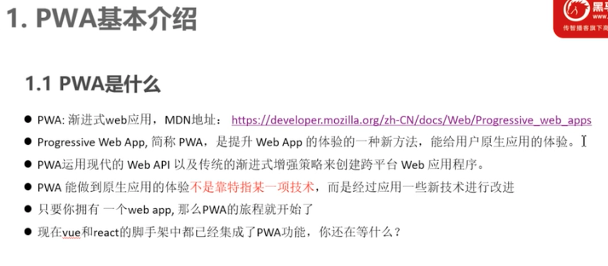
    + PWA 优势
      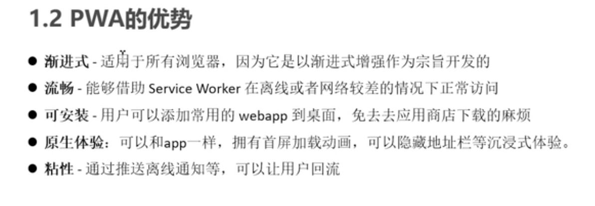    
### PWA核心技术揭秘
  * web app manifest 应用程序清单 Json文件 只能在https协议中使用
    + PWA 核心技术
      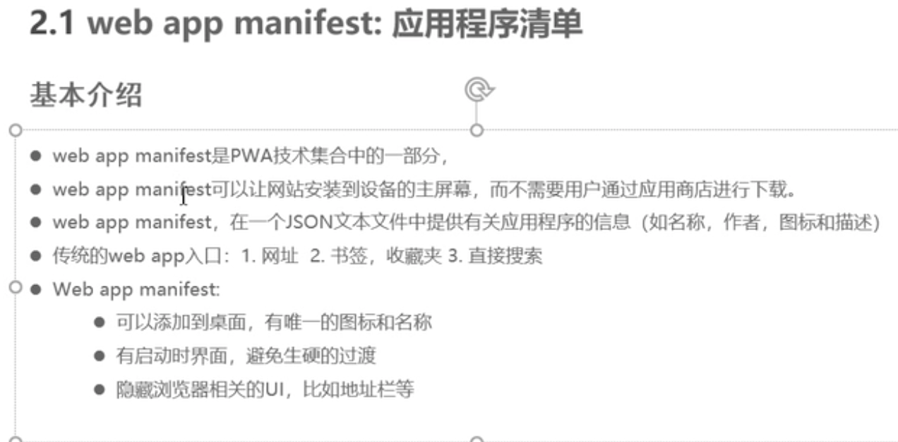
    + web app manifest 应用程序清单
      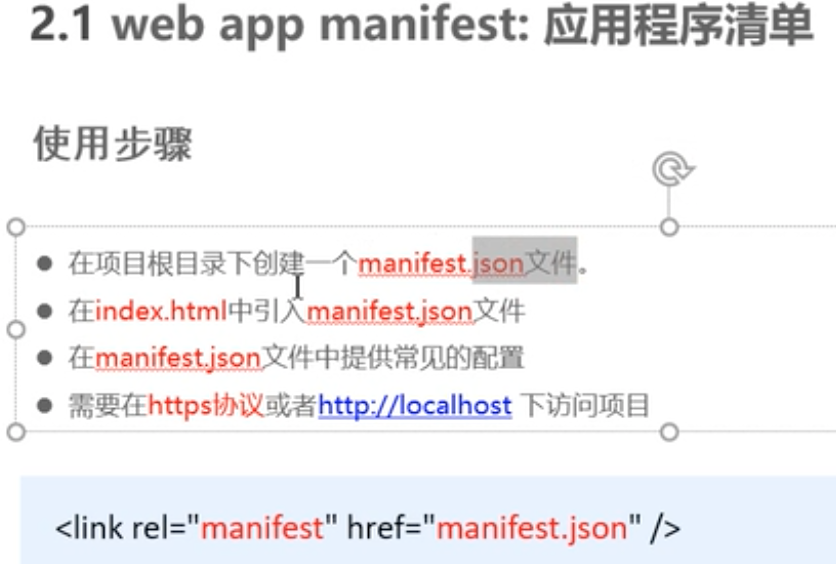
      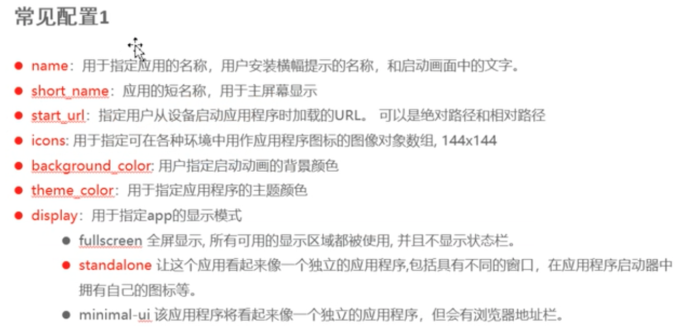
   [MDN地址](https://developer.mozilla.org/zh-CN/docs/Web/Manifest)
  * service worker
    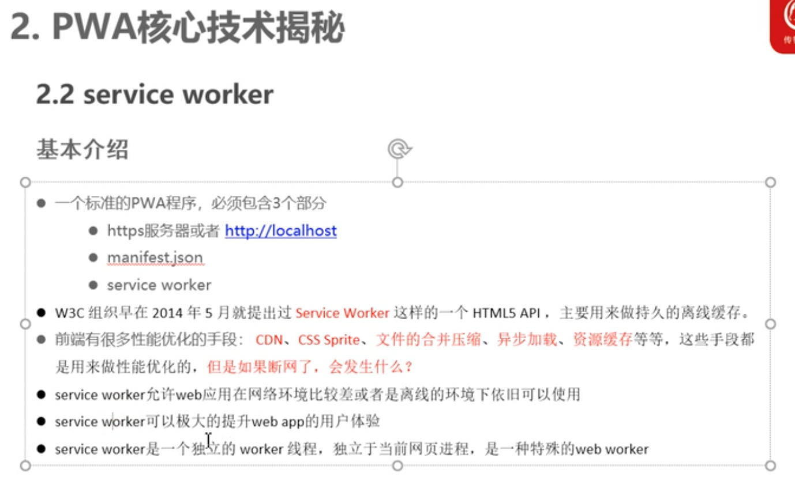
    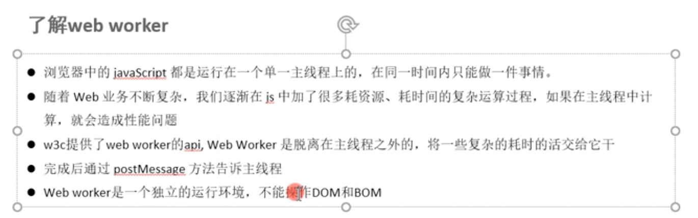
    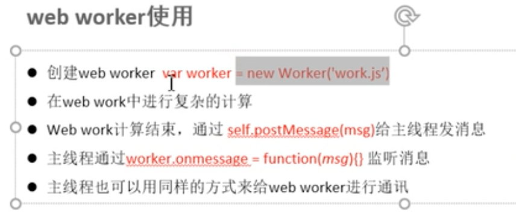
    ```js
    const worker = new Worker('work.js')
    worker.addEventListener("message",e=>{
      console.log(e.data)
    })
    //work.js
    //注意：web worker是一个独立的进程，不能操作DOM和BOM
    //适合做大量的运算
    let total = 0
    for(let i = 0;i<100000000;i++){
      total+=i
    }
    self.postMessage({total:total})
    ```
    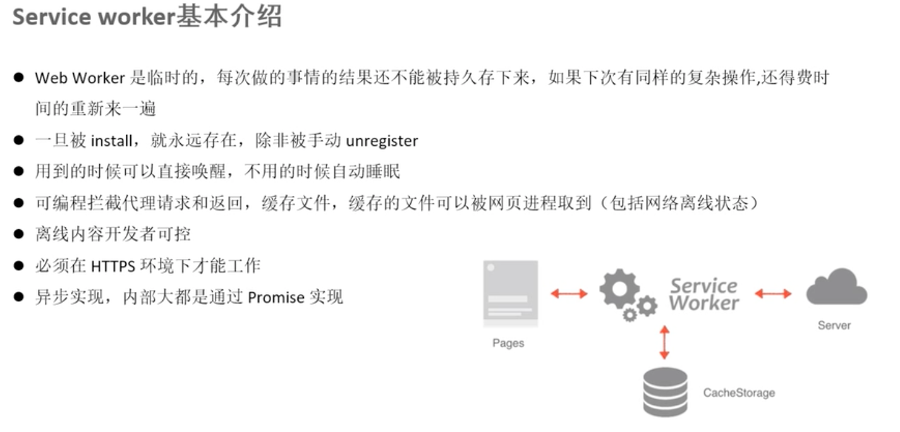
    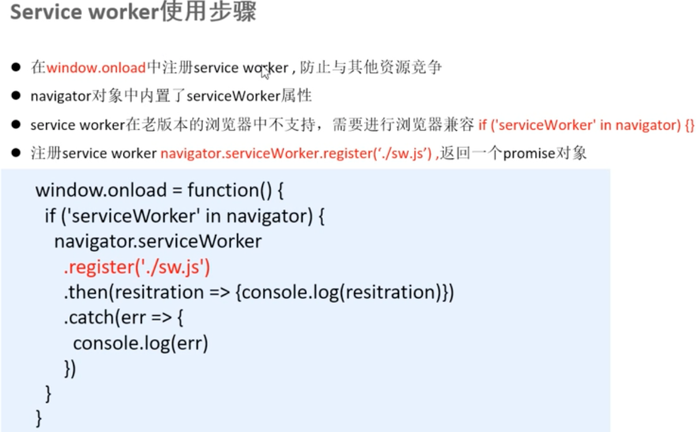
    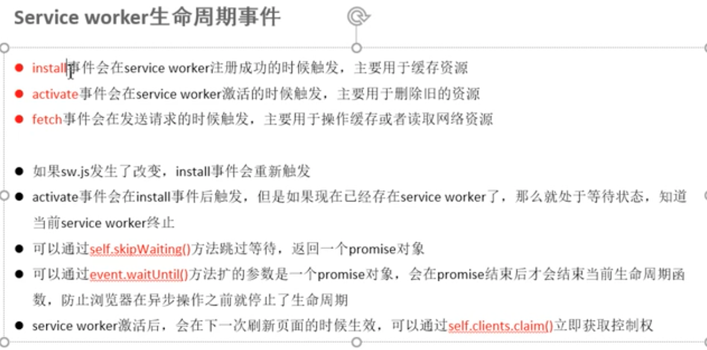    
  * promise / async / await
  * fetch api
  * Cache storage
    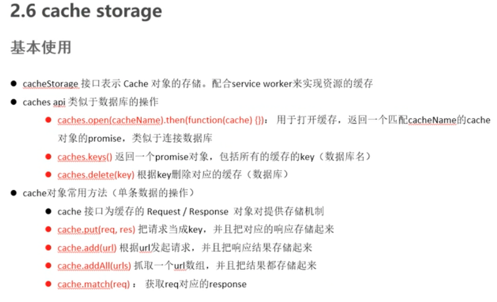
    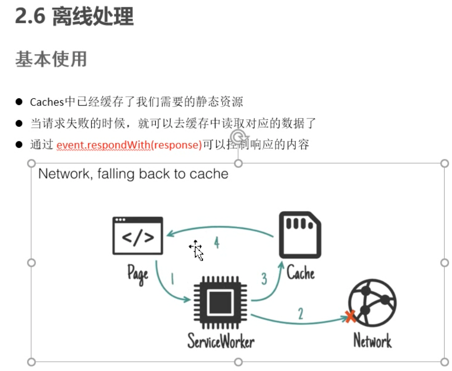
  * 常见的缓存策略
    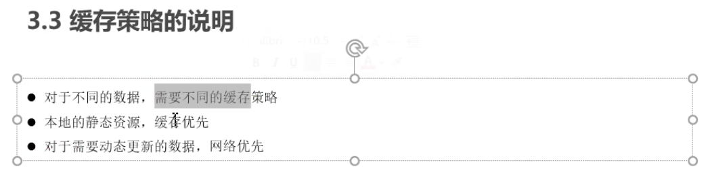
    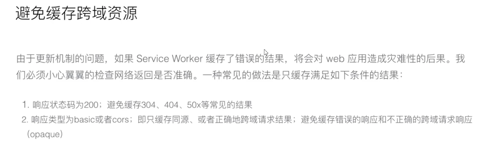
  * notification
    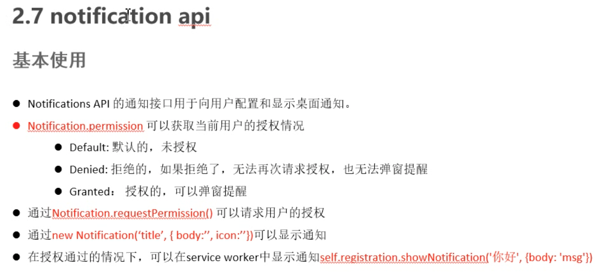
  